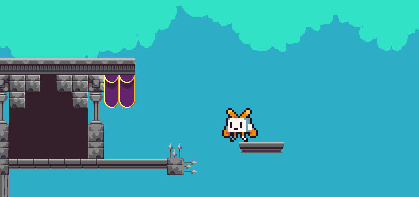
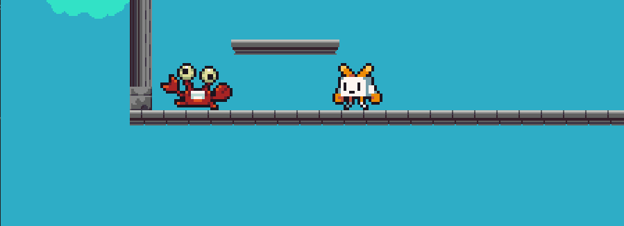

# Игра в жанре платформера

## Описание
Учебный проект простой игры, реализованный с помощью библиотеки pygame, в которой нужно передвигаться и уничтожать противников.
## Что можно делать в данной игре?
- проходить уровни
- побеждать противников
- собирать монеты
## Чему я научился во время составления проекта:
- работать со скростью объекта
- более глубоко изучил библиотеку pygame
- cоздавать свои карты в программе tiled
- работать с анимацией объектов
## Работа игры:

### Персонаж:

### Противник:
